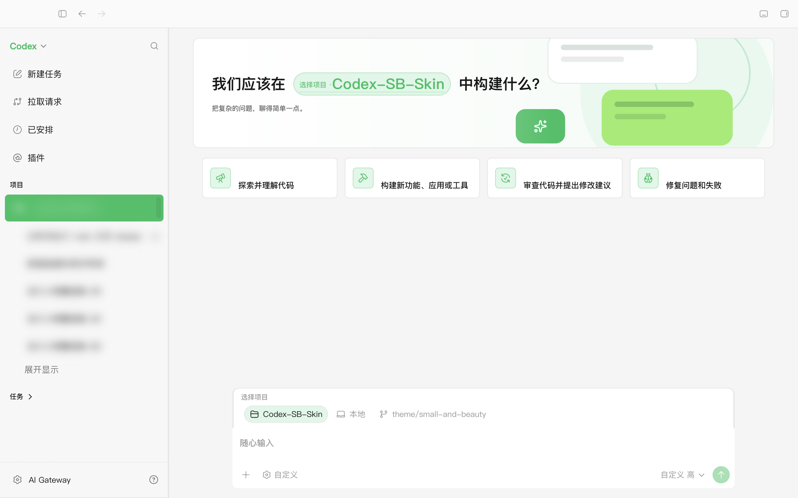
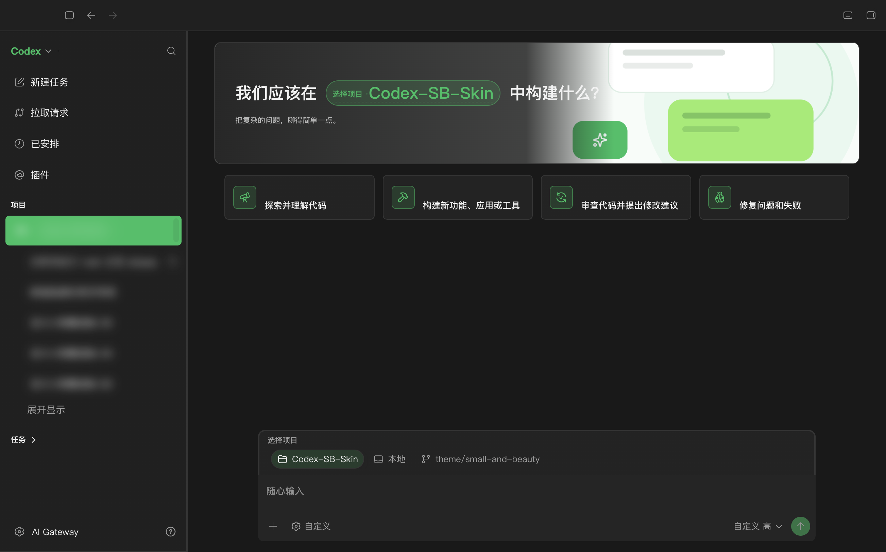
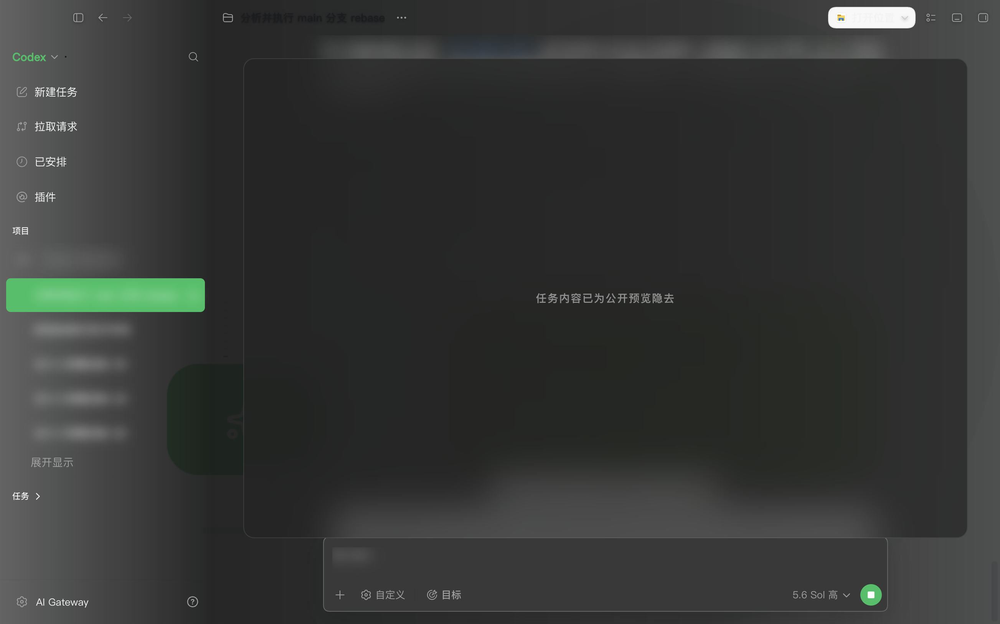

# Small & Beauty · 小而美

<p align="center">
  <strong>把复杂的问题，聊得简单一点。</strong><br>
  为 Codex Desktop 打造的克制、紧凑、原生可交互主题。
</p>

<p align="center">
  
  
  
  <a href="./macos/LICENSE"></a>
</p>

<p align="center">
  
</p>

`Small & Beauty`（小而美）以桌面聊天工具的清晰层级为灵感：灰白工作区、低圆角、细边框、紧凑密度，以及只在关键状态出现的绿色。它不是一张覆盖在窗口上的效果图——侧栏、建议卡、项目选择器、输入框、菜单和任务页面仍然是 Codex 原生控件。

> 非 OpenAI 官方产品。本项目通过仅绑定 `127.0.0.1` 的本机 CDP 注入主题，不修改官方 `.app`、`app.asar`、代码签名、API Key 或 Base URL。

## 主题预览

### 浅色 Home

明亮工作区使用 `#f5f5f5` 画布、白色内容面和 `#07c160` 状态色。建议卡采用紧凑横向布局，Hero 与 820px 输入区保持同一内容轴线。

<p align="center">
  <br>
  <sub>真实 Codex Desktop 注入截图 · 侧栏历史已模糊</sub>
</p>

### 深色 Home

深色外观使用中性黑灰层级，保留绿色强调但减少光晕、渐变和毛玻璃干扰。超宽素材保持在 180px Hero 中，不会扩展为影响文字对比度的整窗背景。

<p align="center">
  <br>
  <sub>真实 Codex Desktop 注入截图 · 侧栏历史已模糊</sub>
</p>

### Task 页面

任务页面保留低对比度抽象对话背景，消息、代码、输入框和原生操作区继续可交互。背景只负责建立主题辨识度，不与正文争夺注意力。

<p align="center">
  <br>
  <sub>真实 Codex Desktop 注入截图 · 任务标题、历史与正文已隐去</sub>
</p>

## 设计特点

| 角色 | 浅色 | 深色 |
| --- | --- | --- |
| 工作区 | `#f5f5f5` | `#191919` |
| 侧栏 | `#f7f7f7` | `#202020` |
| 内容面 | `#ffffff` | `#232323` |
| 关键状态 | `#07c160` | `#07c160` |
| 用户消息 | `#95ec69` | `#3f8f55` |
| 正文 | `#181818` | `#f2f2f2` |

- **紧凑但不拥挤**：44px 侧栏行高、66px 横向建议卡、820px composer。
- **低装饰噪声**：弱阴影、低圆角、细边框，不使用大面积粒子和光晕。
- **关键状态才用绿色**：选中项目、主要操作、焦点和用户消息保持一致语义。
- **浅色与深色独立设计**：不是简单反色，每个表面、文字和消息角色都有单独 token。
- **原生交互保留**：键盘、焦点、菜单、项目选择、任务操作和 composer 行为不被替换。
- **超宽横幅安全构图**：文字安全区位于左侧，视觉主体与对话图形保留在右侧。

## 快速安装

### 要求

- macOS
- 官方 Codex Desktop / ChatGPT.app（bundle id `com.openai.codex`）
- 应用至少启动过一次，且存在 `~/.codex/config.toml`
- 安装时需要完全退出 Codex Desktop（`⌘Q`）

### 全新安装

```bash
git clone https://github.com/etnperlong/Codex-SB-Skin.git
cd Codex-SB-Skin

# 安装当前默认分支的最新引擎；暂不启动应用
./macos/scripts/install-dream-skin-macos.sh --no-launch

# 将 Small & Beauty 放入本地主题库
THEME_LIBRARY="$HOME/Library/Application Support/CodexDreamSkinStudio/themes/small-and-beauty"
mkdir -p "$THEME_LIBRARY"
cp -f macos/assets/theme.json macos/assets/portal-hero.png "$THEME_LIBRARY/"
chmod 600 "$THEME_LIBRARY/"*

# 选中主题并启动带 loopback CDP 的 Codex Desktop
"$HOME/.codex/codex-dream-skin-studio/scripts/switch-theme-macos.sh" \
  --id small-and-beauty \
  --no-apply

"$HOME/.codex/codex-dream-skin-studio/scripts/start-dream-skin-macos.sh" \
  --port 9341
```

### 已有仓库更新

先在 Codex Desktop 中按 `⌘Q`，然后运行：

```bash
cd /path/to/Codex-SB-Skin
git switch theme/small-and-beauty
git pull --ff-only origin theme/small-and-beauty
./macos/scripts/install-dream-skin-macos.sh --no-launch
```

随后重新执行上方“放入本地主题库 → 选中主题 → 启动”三步。

## 验证是否生效

```bash
"$HOME/.codex/codex-dream-skin-studio/scripts/doctor-macos.sh" \
  --require-live

"$HOME/.codex/codex-dream-skin-studio/scripts/verify-dream-skin-macos.sh" \
  --screenshot "$HOME/Desktop/Small & Beauty Verification.png"
```

验证结果应包含：

```text
themeId: small-and-beauty
themeName: Small & Beauty
themeSchemaVersion: 2
```

## 暂停或恢复官方外观

暂停当前注入：

```bash
"$HOME/.codex/codex-dream-skin-studio/scripts/pause-dream-skin-macos.sh"
```

恢复配置并重新启动官方外观：

```bash
"$HOME/.codex/codex-dream-skin-studio/scripts/restore-dream-skin-macos.sh" \
  --restore-base-theme \
  --restart-codex
```

恢复操作只停止本项目的注入器并还原其备份的配置，不修改官方应用文件。

## Schema V2

Small & Beauty 是 `theme.json` Schema V2 的完整参考主题。它通过 271 个语义 token 控制：

- Light / Dark 颜色角色
- 侧栏、主界面、消息、composer、卡片、代码块和弹层
- 字体、字号、字重和行高
- 圆角、边框、内容宽度和密度
- 阴影、模糊、透明度和动效

局部主题只需覆盖自己关心的 token，缺失值会继续跟随自适应图像引擎和 Codex 原生浅色/深色外观。

- Schema 文档：[`macos/references/theme-schema-v2.md`](./macos/references/theme-schema-v2.md)
- 上游 Pull Request：[#147 — Semantic theme schema v2](https://github.com/Fei-Away/Codex-Dream-Skin/pull/147)
- 主题配置：[`macos/assets/theme.json`](./macos/assets/theme.json)

## 开发与测试

```bash
cd macos
npm test
```

测试覆盖 JavaScript / shell 语法、主题 payload、Schema V1 兼容、Schema V2 token、安全值拒绝、图片元数据、配置往返、签名与 doctor 检查。

涉及 CSS 或 renderer 的改动还应在真实 Codex Desktop 中检查：

- Home 与 Task 路由
- 浅色与深色外观
- 侧栏选中态与 Tooltip
- 建议卡图标、项目选择器和 composer 对齐
- 横向滚动与窗口缩放

## 项目结构

```text
macos/assets/theme.json                 Small & Beauty 语义 token
macos/assets/portal-hero.png            抽象对话横幅
macos/assets/dream-skin.css             主题与兼容样式
macos/scripts/theme-schema.mjs          Schema V2 解析与安全校验
macos/references/theme-schema-v2.md     Schema V2 参考
docs/images/small-and-beauty/           隐私处理后的实机预览
```

## 安全与隐私

- CDP 仅绑定 `127.0.0.1`，不会暴露到局域网。
- 不修改官方 `.app`、`app.asar`、WindowsApps 或代码签名。
- 不读取、上传或改写 API Key、Base URL 和模型供应商设置。
- 主题图片和图像分析都保留在本机。
- README 中的实机截图在捕获前已隐藏任务历史、标题和正文；仓库未保存未遮蔽版本。

## 致谢

- 上游项目：[Fei-Away/Codex-Dream-Skin](https://github.com/Fei-Away/Codex-Dream-Skin)
- `Small & Beauty` 主题与 Schema V2 移植由 [@etnperlong](https://github.com/etnperlong) 维护。

## License

代码按 [`macos/LICENSE`](./macos/LICENSE) 中的 MIT License 发布。商标与附加声明见 [`macos/NOTICE.md`](./macos/NOTICE.md)。Codex、ChatGPT 与 OpenAI 名称及标识归其各自权利人所有。
